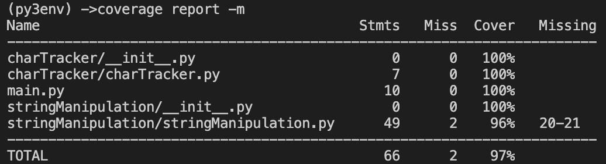

You observe a program behaves like this

aaeeeeebcdffff -> aaze5bcdzf4
aefrtdddggg -> aefrtzd3zg3
aertttefze -> aerzt3efze 
hhhhhhhhh2z -> zh92z
inputString = "aaeeeeeeebcdff"
outputString = "za2ze7zb1zc1zd1zf2"

## Write a program that performs this encoding

```virtualenv -p /usr/local/bin/python3 py3env```


Using Python 3.7.0 - ```source ../py3env/bin/activate```

```coverage run main.py```


```coverage report -m```

